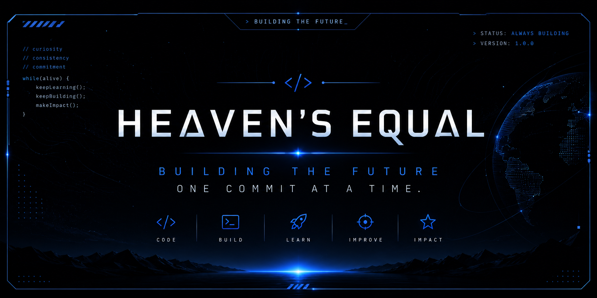

  

---

## About

Curiosity drives everything I build.

Every project is an opportunity to learn,
improve, and create something meaningful.

---

## Contribution Streak

<table align="center">
<tr>

<td align="right" width="30%">

 

</td>

<td align="center" width="40%">

</td>

<td align="left" width="30%">

 

</td>

</tr>
</table>

---

  

---

## Featured Projects

🧮 **Scientific Calculator**

> A modern scientific calculator built with HTML, CSS & JavaScript.

🚀 More projects are on the way.

---

## Philosophy

> **Every project begins with curiosity.**

---

Thanks for visiting.

